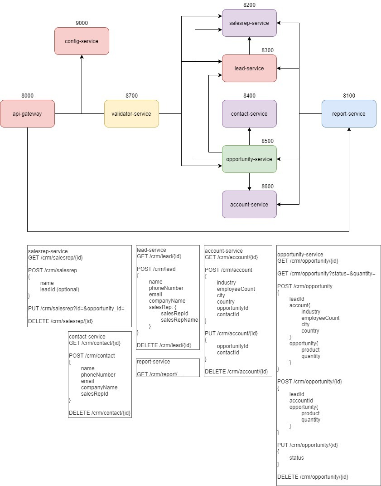

<!-- PROJECT SHIELDS -->
<!--
*** I'm using markdown "reference style" links for readability.
*** Reference links are enclosed in brackets [ ] instead of parentheses ( ).
*** See the bottom of this document for the declaration of the reference variables
*** for contributors-url, forks-url, etc. This is an optional, concise syntax you may use.
*** https://www.markdownguide.org/basic-syntax/#reference-style-links
-->
[![Contributors][contributors-shield]][contributors-url]
[![CRM][CRM-shield]][CRM-url]
[![Ironhack][Ironhack-shield]][Ironhack-url]
[![Santander][Santander-shield]][Santander-url]

<!-- PROJECT LOGO -->


<br />
<p align="center">

  <h3 align="center">CRM</h3>

  <p align="center">
    CRM project created by tEapot! team:
    <br />
    <a href="https://github.com/natyfromwonderland"><strong>Natalia Shilyaeva</strong></a>
    ·
    <a href="https://github.com/Mat-Poreda"><strong>Mateusz Poreda</strong></a>
    ·
    <a href="https://github.com/MigNeves"><strong>Miguel Neves</strong></a>
    ·
    <a href="https://github.com/patrykwieteska"><strong>Patryk Wieteska</strong></a>
  </p>


<!-- TABLE OF CONTENTS -->
<details open="open">
  <summary><h2 style="display: inline-block">Table of Contents</h2></summary>
  <ol>
    <li>
      <a href="#about-the-project">About The Project</a>
      <ul>
        <li><a href="#class-diagram">Class Diagram</a></li>
        <li><a href="#built-with">Built With</a></li>
      </ul>
    </li>
    <li>
      <a href="#getting-started">Getting Started</a>
      <ul>
        <li><a href="#installation">Installation</a></li>
      </ul>
    </li>
    <li><a href="#usage">Usage</a></li>
      <ul>
        <li><a href="#reporting-API-patterns">Reporting API Patterns</a></li>
      </ul>
     <ul>
        <li><a href="#post-requests">Post Requests</a></li>
      </ul>
    <li><a href="#roadmap">Roadmap</a></li>
    <li><a href="#issues">Known Issues</a></li>
    <li><a href="#contributing">Contributing</a></li>
    <li><a href="#license">License</a></li>
    <li><a href="#contact">Contact</a></li>
    <li><a href="#acknowledgements">Acknowledgements</a></li>
  </ol>
</details>


<!-- ABOUT THE PROJECT -->
## About The Project

This is a microservice reiteration of a [project of CRM application](https://github.com/EN-IH-WDPT-JUN21/DeadCodersSociety-ClubRickyMartin-Stage2-Homework-3)  which allow user to manage workflow of acquiring *leads* and convert them to sale *opportunities*.

### Class Diagram


### Built With

* [IntelliJ](https://www.jetbrains.com/idea/)
* [Java](https://www.java.com/en/)


<!-- GETTING STARTED -->
## Getting Started

To get a local copy up and running follow these simple steps.

### Installation

1. Clone the repo
   ```sh
   git clone https://github.com/EN-IH-WDPT-JUN21/tEapot-Microservices-CRM.git
   ```
2. Build a new project in IntelliJ by File -> New -> Project from Version Control
3. Paste the copied URL and follow instructions.
4. Project is based on H2 Database, so no database configuration is required.
5. If projects are not recognised as Maven project -> right click on POM file and click "Add as a Maven project"
6. Run the application.


<!-- USAGE EXAMPLES -->
## Usage
<p>
Project contains several services. Run all of them by starting the main class of every service.
We recommend starting from the Server.
This application works on a API input, so every command should be sent as a HTTP Request with valid parameters and/or body.
The Gateway runs on port 8000.

Users with ADMIN role have most permissions (login: *admin*, password: *admin*).

</p>


### Reporting API Patterns


| type | route                                      | descriprion                                                                   | permissions |
| ---- | ------------------------------------------ | ----------------------------------------------------------------------------- | ----------- |
| GET  | /crm/report/report-lead-by-salesrep        | Get number of leads by sales representative                                   | ADMIN       |
| GET  | /crm/report/report-opportunity-by-salesrep | Get number of opportunities by sales representative                           | ADMIN       |
| GET  | /crm/report/report-closed-won-by-salesrep  | Get number of opportunities with 'closed-won' status by sales representative  | ADMIN       |
| GET  | /crm/report/report-closed-lost-by-salesrep | Get number of opportunities with 'closed-lost' status by sales representative | ADMIN       |
| GET  | /crm/report/report-open-by-salesrep        | Get number of opportunities with 'open' status by sales representative        | ADMIN       |
| GET  | /crm/report/report-opportunity-by-product  | Get number of opportunities by product type                                   | ADMIN       |
| GET  | /crm/report/report-closed-won-by-product   | Get number of opportunities with 'closed-won' status by product type          | ADMIN       |
| GET  | /crm/report/report-closed-lost-by-product  | Get number of opportunities with 'closed-lost' status by product type         | ADMIN       |
| GET  | /crm/report/report-open-by-product         | Get number of opportunities with 'open' status by product type                | ADMIN       |
| GET  | /crm/report/report-opportunity-by-country  | Get number of opportunities by country                                        | ADMIN       |
| GET  | /crm/report/report-closed-won-by-country   | Get number of opportunities with 'closed-won' status by country               | ADMIN       |
| GET  | /crm/report/report-closed-lost-by-country  | Get number of opportunities with 'closed-lost' status by country              | ADMIN       |
| GET  | /crm/report/report-open-by-country         | Get number of opportunities with 'open' status by country                     | ADMIN       |
| GET  | /crm/report/report-opportunity-by-city     | Get number of opportunities by city                                           | ADMIN       |
| GET  | /crm/report/report-closed-won-by-city      | Get number of opportunities with 'closed-won' status by city                  | ADMIN       |
| GET  | /crm/report/report-closed-lost-by-city     | Get number of opportunities with 'closed-lost' status by city                 | ADMIN       |
| GET  | /crm/report/report-open-by-city            | Get number of opportunities with 'open' status by city                        | ADMIN       |
| GET  | /crm/report/report-opportunity-by-industry | Get number of opportunities by industry                                       | ADMIN       |
| GET  | /crm/report/report-closed-won-by-industry  | Get number of opportunities with 'closed-won' status by industry              | ADMIN       |
| GET  | /crm/report/report-closed-lost-by-industry | Get number of opportunities with 'closed-lost' status by industry             | ADMIN       |
| GET  | /crm/report/report-open-by-industry        | Get number of opportunities with 'open' status by industry                    | ADMIN       |
| GET  | /crm/report/mean-employeecount             | Get average value of employees                                                | ADMIN       |
| GET  | /crm/report/median-employeecount           | Get median value of employees                                                 | ADMIN       |
| GET  | /crm/report/max-employeecount              | Get maximum value of employees                                                | ADMIN       |
| GET  | /crm/report/min-employeecount              | Get minimum value of employees                                                | ADMIN       |
| GET  | /crm/report/mean-quantity                  | Get average value of products                                                 | ADMIN       |
| GET  | /crm/report/median-quantity                | Get median value of products                                                  | ADMIN       |
| GET  | /crm/report/max-quantity                   | Get maximum value of products                                                 | ADMIN       |
| GET  | /crm/report/min-quantity                   | Get minimum value of products                                                 | ADMIN       |
| GET  | /crm/report/mean-opps-per-account          | Get average value of opportunities per account                                | ADMIN       |
| GET  | /crm/report/median-opps-per-account        | Get median value of opportunities per account                                 | ADMIN       |
| GET  | /crm/report/max-opps-per-account           | Get maximum value of opportunities per account                                | ADMIN       |
| GET  | /crm/report/min-opps-per-account           | Get minimum value of opportunities per account                                | ADMIN       |


Calls to most services follow a similar pattern apart from the requests specified in the next section. For example:


| type   | route             | descriprion                                             | permissions     |
| ------ | ----------------- | ------------------------------------------------------- | --------------- |
| GET    | /crm/account/{id} | Get account details with given id                       | ADMIN           |
| GET    | /crm/account      | Get all accounts                                        | ADMIN           |
| POST   | /crm/account      | Create new account                                      | ADMIN, SALESREP |
| DELETE | /crm/account/{id} | Delete account with given id                            | ADMIN           |


### More Complicated Post Requests


Placeholder to explain convertLead etc.


<!-- ROADMAP -->
## Roadmap
This project is still in early development. Future functionalities are yet to be determined.

## Issues
See the [open issues](https://github.com/EN-IH-WDPT-JUN21/tEapot-Microservices-CRM/issues) for a list of known issues.


<!-- CONTRIBUTING -->
## Contributing

Contributions are what make the open source community such an amazing place to be learn, inspire, and create. Any contributions you make are **greatly appreciated**.

1. Fork the Project
2. Create your Feature Branch (`git checkout -b feature/AmazingFeature`)
3. Commit your Changes (`git commit -m 'Add some AmazingFeature'`)
4. Push to the Branch (`git push origin feature/AmazingFeature`)
5. Open a Pull Request


<!-- LICENSE -->
## License

Distributed under the MIT License. See `LICENSE` for more information.


<!-- CONTACT -->
## Contact

Project Link: [https://github.com/EN-IH-WDPT-JUN21/tEapot-Microservices-CRM](https://github.com/EN-IH-WDPT-JUN21/tEapot-Microservices-CRM)


<!-- ACKNOWLEDGEMENTS -->
## Acknowledgements

* [Code breaking is welcome. If you'll be able to break this application please let us know!](https://github.com/orgs/EN-IH-WDPT-JUN21/teams/teapot)
* Test all the features! You may find something special!


<!-- MARKDOWN LINKS & IMAGES -->
<!-- https://www.markdownguide.org/basic-syntax/#reference-style-links -->
[contributors-shield]: https://img.shields.io/static/v1?label=Team&message=tEapot!&color=brightgreen&
[contributors-url]: https://github.com/orgs/EN-IH-WDPT-JUN21/teams/teapot
[CRM-Shield]: https://img.shields.io/static/v1?label=Project&message=CRM&color=yellowgreen&
[CRM-url]: https://en.wikipedia.org/wiki/Customer_relationship_management
[ironhack-shield]: https://img.shields.io/static/v1?label=Bootcamp&message=Ironhack&color=blue&
[ironhack-url]: https://www.ironhack.com/en
[Santander-shield]: https://img.shields.io/static/v1?label=SponsoredBy&message=Santander&color=red&
[Santander-url]: https://www.becas-santander.com/en/index.html
[IntelliJ-shield]: https://img.shields.io/static/v1?label=IDE&message=IntelliJ&color=red&
[IntelliJ-url]: https://www.jetbrains.com/idea/
